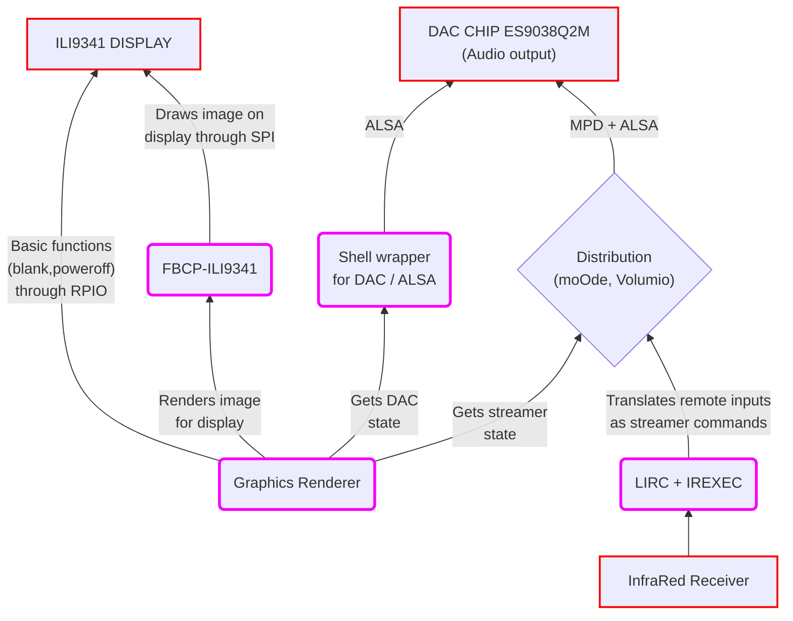

# Patch compiler for RaspDacMini LCD

This branch holds all the code used to package an installer for the RaspDacMini LCD. 

## Currently supported : 
  * moOde Audio 32-bit 
  * moOde Audio 64-bit 


## Read this before you do anything with this code
* Make sure you are using the LCD version of the RaspDacMini. None of this will work on the previous OLED version (see picture below if you have any doubt). 

   

  If you need to work on a version with an OLED display, you should [go there instead](https://github.com/audiophonics/RaspDacMini). 


* If you are a regular user with a RaspDacMini LCD who seeks to have the display & remote working after a first install, this is **not** the right place for you. The easy and fast way to achieve this is to use a [precompiled patch archive](https://github.com/audiophonics/RaspDacMinilcd/blob/patch_compiler/README.md#precompiled-archives).

* The point of this repo is to provide a way to rebuild the customizations if for whatever reason you lost the display / remote / SPDIF support after a software update and the pre-built patch does not work anymore on the newly updated distribution. You can also use this branch as a work basis when porting the display to new hardware (the fbcp-ili9341 driver used here supports others LCD display).


# Anatomy of a fully customized RDMLCD 
The RDMLCD uses different pieces of software (*pink*) to make use of its specific hardware (*red*).


The goal of this patch compiler is to provide an archive containing everything needed to have the right software (pink elements) at the right place in the distribution you picked. The method vary largely depending on what is available through the package manager of the distribution. 
<br><br>
* *FBCP-ILI9341* is the (awesome) driver in charge of using the SPI bus to provide a smooth and nice image on the display. Here is the [source repository](https://github.com/juj/fbcp-ili9341) for the project if you want to know more about it. 
  *  We build the driver from source and package the binaries as a tar archive. All of this is [done in this script : fbcp-ili9341/build.sh](fbcp-ili9341/build.sh).
  *  We then provide an [installation script](fbcp-ili9341/installation) for the distribution which : 
     * extracts the tar archive in the right path
     * installs all required dependencies (especially in moOde Audio which can now run either 32-bit or 64-bit architectures)
     * edits either /boot/config.txt or /boot/userconfig.txt to set hdmi_group / hdmi_mode / hdmi_cvt
     * configures the system to start the display when the RaspDacMiniLCD boots
   * Along the binaries, we provide a short [*sh* script](fbcp-ili9341/rdmlcdfb) exposed as a shell command ```rdmlcdfb``` in charge of running the whole set of commands needed to have the display framebuffer running properly and hiding the console at boot.
<br><br>

* *The Graphic Renderer* is a nodeJS app using [node-canvas](https://github.com/Automattic/node-canvas) (a wrapper for Cairo surface) to render a real-time image representing the Streamer current state (what you see on the display).
  * the node-canvas module must be compiled with node-gyp 
  * it also uses [node-rpio](https://github.com/jperkin/node-rpio) to execute basic SPI commands such as blanking the display before poweroff. This has to be compiled as well.
  * the blur effect on the back CoverArt is achieved thanks to [stackblur-canvas](https://github.com/flozz/StackBlur) which does not require compiling.
  * all the components (including modules designed for polling the streamer according to the specific distributions) are compiled, downloaded and packaged as a ready-to-use nodejs App in [this script](lcd/build.sh). We then provide an [installation script](lcd/installation) meant to extract the files at the right place, install dependencies and configure the graphic renderer to run at boot. <br><br>
  *Note that many of the modules used in this nodeJS app have to be packaged as compiled binaries since we want to avoid using buidling toolchains on the RDMLCD, so we only make a partial use of NPM to achieve this since it does not support that paradigm well).*
<br><br>
        
* *The LIRC + IREXEC* section mainly consists of providing a script for automatic installation of LIRC & IREXEC binaries on the distribution through package manager. It also creates an archive containing the configuration files to allow LIRC to work with the remote we provided with the RDMLCD. All of this is done [here](remote/installation). 
<br><br>    

* *The Shell wrapper for DAC / ALSA* includes :
  * a very short [sh script](dac/apessq2m) meant to provide an easy way to get/set the internal states of the ES9038Q2M DAC including its SPDIF output and navigate through its reconstruction filters. It is exposed as a shell command : ```apessq2m```.
  * it also comes with an [installation script](dac/installation) that will try to do the maximum to preconfigure the streamer proprietary configuration (setting the ES9038 DAC as the current audio output for MPD). Note that due to the fact that each distribution offer more and more options over time, this is not 100% trustworthy and the user should be encouraged to check the WEBUI to ensure everything is configured as it should be (Audiophonics ES9038 as DAC output + hardware volume).
<br><br>    

# How to use this toolset to build a patch
* First you need to boot a RDMLCD with a fresh install of the distribution for which you intend to build the patch.
* SSH into the RDMLCD 
* Download this branch as an archive to get the source files
* Extract the archive
* Enter the *patch_compiler* directory
* Install build dependencies
* Build the patch for the target distribution
* Package and download the patch
* Apply the patch on a fresh installation of the distribution you intend to use

Which translates in code as :
```
# Get the source files
wget https://github.com/audiophonics/RaspDacMinilcd/archive/patch_compiler.zip

# Extract the archive 
unzip patch_compiler.zip

# Enter directory
cd RaspDacMinilcd-patch_compiler

# install build dependencies (this command is interactive and will ask for a target distribution)
sh install_dependencies.sh 

# build all components as a single archive (this command is interactive and will ask for a target distribution)
sh build_all.sh moode
```
I left in this repo a couple scripts to be used as build tools. At the root of this project are the following scripts : 
  * **```install_dependencies.sh```** : installing toolchains and dependencies for compiling all the RDMLCD components.
  * **```build_all.sh```** : building all components in a directory named ***release***.
  * **```clear.sh```** : remove all previously built components.
  * **```packsources.sh```** : use this after modifying the source code to get an archive with all the contents of the patch_compiler directory (do not forget to run clear.sh before doing this or the resulting archive will be 2x heavier than it should).
<br>

If you want to (re)build a single specific component, you can instead go to the corresponding directory and run the ```build.sh``` which will create its own local ***release*** subdirectory.


# Precompiled archives
Before you attempt doing anything with this branch, you should try a precompiled patch. Pick the correct distribution and follow the instructions given by the link : 
  * [moOde Audio 8+](https://github.com/audiophonics/RaspDacMinilcd/tree/moode)
  * [moOde Audio <8 and Volumio <3](https://github.com/audiophonics/RaspDacMinilcd/tree/main)
  * The sources for Volumio 3+ are not available yet but you can find a [full working image there](https://www.audiophonics.fr/en/blog-diy-audio/23-start-up-evo-raspdac-rasptouch-raspdac-mini-with-a-pre-configured-image.html#rdmlcd).
    * Actually the Volumio team gave me everything I need to publish Volumio plugins. I am trying to enable this toolset to output a plugin archive instead so I can easily publish and update this whole customization as a plugin, however this process takes ages.
